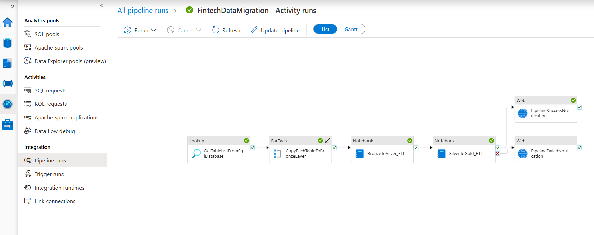

# Data Migration with Azure Synapse, PySpark, and Delta Tables

This project sets up an end-to-end data pipeline that transforms and processes historical data from a SQL Database into a structured format in Azure Synapse Analytics, utilizing Azure Data Lake Storage (ADLS) and Delta Tables for efficient storage and querying.

## Tech Stack

- **Python**
- **Azure SQL Database**
- **T-SQL (Transact-SQL)**
- **Azure Synapse Analytics**
- **Azure Data Lake Storage (ADLS)**
- **Azure Notebook**
- **PySpark**
- **Delta Tables**

## Pipeline Overview

The data pipeline consists of the following stages:

- **Bronze Layer**: Raw, unprocessed data stored in ADLS.
- **Silver Layer**: Cleaned and transformed data stored as Delta Tables.
- **Gold Layer**: Final, highly-optimized dataset for analytics and reporting.

## Pipeline Activities

The pipeline consists of the following activities:

1. **GetTableListFromSqlDatabase**:
   - A **Lookup** activity that queries the SQL database to retrieve a list of base tables from the 'fintech' schema.

2. **CopyEachTableToBronzeLayer**:
   - A **ForEach** activity that iterates over the tables fetched in the previous step and copies each table from SQL to the **Bronze layer** in ADLS using the **Copy** activity.

1. **BronzeToSilver_ETL**:
   - A **SynapseNotebook** activity that processes the data in the Bronze layer and performs ETL transformations, storing the results in the **Silver layer**.

2. **SilverToGold_ETL**:
   - A **SynapseNotebook** activity that further transforms the data from the Silver layer and writes the final dataset to the **Gold layer**.

3. **PipelineSuccessNotification**:
   - A **WebActivity** that sends an email notification on successful completion of the pipeline.

4. **PipelineFailedNotification**:
   - A **WebActivity** that sends an email notification if the pipeline fails.

## Parameters

- **to**: Email recipient.
- **emailSubjectSuccess** and **emailBodySuccess**: Customizable email subject and body for success notifications.
- **emailSubjectFailed** and **emailBodyFailed**: Customizable email subject and body for failure notifications.

## Steps

### 1. SQL Database Preparation

Create and structure a SQL database with tables containing historical data that will serve as the source for further processing.

### 2. Data Pipeline Setup in Azure Synapse

Set up a dynamic data pipeline in Azure Synapse to move data from the SQL Database to the **Bronze Layer** in Azure Data Lake Storage (ADLS). This step handles raw data storage for further transformations.

### 3. Bronze to Silver Transformation (PySpark)

Create and configure a PySpark notebook to read the raw data from the Bronze Layer and transform it into a more refined format, which is then written into the **Silver Layer** as Delta Tables.

### 4. Silver to Gold Transformation (PySpark)

Develop and configure another PySpark notebook to read the transformed data from the Silver Layer, apply further processing, and write the final, optimized dataset into the **Gold Layer** as Delta Tables for high-quality data.

### 5. Automated Pipeline Execution

Set up an automated pipeline in Azure Synapse to manage and sequentially execute all the steps in the data pipeline, ensuring seamless execution and data flow from one stage to the next.

## Summary of Flow

- **Data Retrieval**: The pipeline starts by fetching table names from the SQL database.
- **Data Migration to Bronze**: The tables are copied to the Bronze layer in ADLS.
- **ETL Processes**: Data is transformed in the Bronze layer, moved to the Silver layer, and then to the Gold layer.
- **Notification**: The pipeline sends email notifications based on the success or failure of the pipeline execution.

This setup ensures that the data moves seamlessly from SQL to ADLS, undergoes transformation, and finishes with a notification of success or failure.
