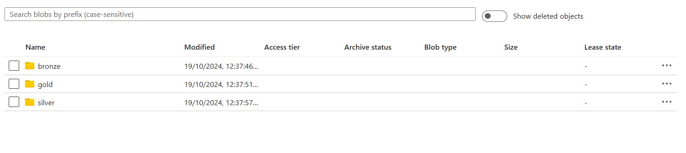

# Data Migration with Azure Synapse, PySpark, and Delta Tables

This project sets up an end-to-end data pipeline that transforms and processes historical data from a SQL Database into a structured format in Azure Synapse Analytics, utilizing Azure Data Lake Storage (ADLS) and Delta Tables for efficient storage and querying.

## Tech Stack

- **Python**
- **Azure SQL Database**
- **T-SQL (Transact-SQL)**
- **Azure Synapse Analytics**
- **Azure Data Lake Storage (ADLS)**
- **Azure Logic App**
- **Azure Notebook**
- **PySpark**
- **Delta Tables**

## Table of Contents

1. [Pipeline Overview](#pipeline-overview)
2. [Pipeline Activities](docs/Pipeline_Activities.md)
3. [Parameters](docs/Parameters.md)
4. [Pipeline Steps](docs/Pipeline_Steps.md)
5. [Summary of Flow](docs/Summary.md)

## Pipeline Overview

The data pipeline consists of the following stages:

## Pipeline Overview

The data pipeline consists of the following stages:

- **Bronze Layer**: Raw, unprocessed data directly coming from each table stored in the Azure SQL database. All these tables are stored in **Parquet** format in **Azure Data Lake Storage (ADLS)** for further processing.
- **Silver Layer**: Cleaned and transformed data stored as **Delta Tables** for optimized querying and performance.
- **Gold Layer**: The final, optimized dataset containing **dimension** and **fact** tables, designed for high-performance analytics and reporting.

For detailed activity descriptions, see [Pipeline Activities](docs/Pipeline_Activities.md).
