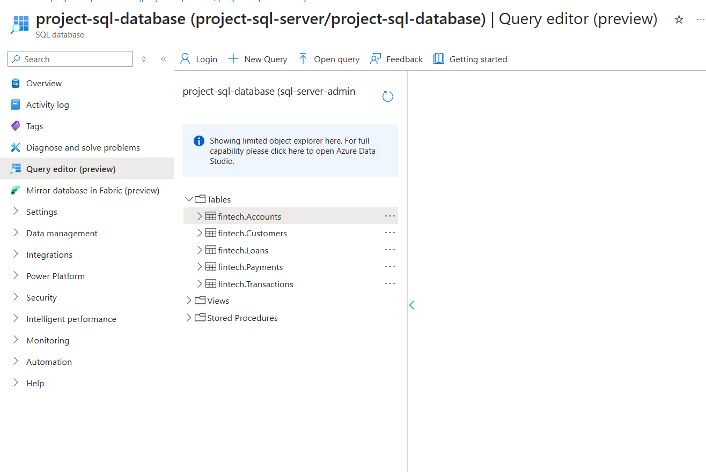
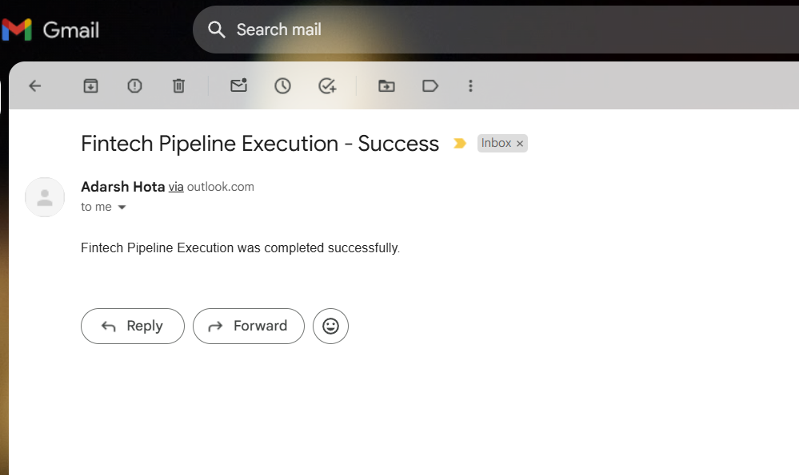

# Pipeline Activities

The pipeline includes the following main activities:

1. **GetTableListFromSqlDatabase**:
   - A **Lookup** activity that queries the SQL database to retrieve a list of base tables from the 'fintech' schema.
   - [View the SQL query configuration](../src/utils/query_tables_list_for_lookup_activity.sql)

2. **CopyEachTableToBronzeLayer**:
   - A **ForEach** activity that iterates over the tables fetched in the previous step and copies each table from SQL to the **Bronze layer** in ADLS using the **Copy** activity.

3. **BronzeToSilver_ETL**:
   - A **SynapseNotebook** activity that processes the data in the Bronze layer and performs ETL transformations, storing the results in the **Silver layer**.
   - [View the Azure Notebook code](../notebooks/BronzeToSilver_ETL.ipynb)

4. **SilverToGold_ETL**:
   - A **SynapseNotebook** activity that further transforms the data from the Silver layer and writes the final dataset to the **Gold layer**.
   - [View the Azure Notebook code](../notebooks/SilverToGold_ETL.ipynb)

### 5. **PipelineSuccessNotification**
   - The **WebActivity** sends an HTTP request to the **Logic App** upon pipeline success. The Logic App is configured to receive the request containing email details such as recipient, subject, and body, and sends an email using **Outlook**.

*Above: Logic App workflow triggered by the HTTP request from WebActivity.*

   #### Logic App Workflow:
   - **Trigger**: The Logic App is triggered by an HTTP request from the **WebActivity** within the pipeline.
   - **Action**: Once triggered, the Logic App sends an email to the specified recipient, using the subject and body details defined in the request.

*Above: Example of the email sent upon pipeline success.*

### 6. **PipelineFailedNotification**
   - Similarly, another **WebActivity** is used to send an email notification if the pipeline fails. This triggers a different Logic App workflow to notify the relevant recipients about the failure.
  

*Above: Example of the email sent upon pipeline fail.*

For parameter details, see [Parameters](Parameters.md).
