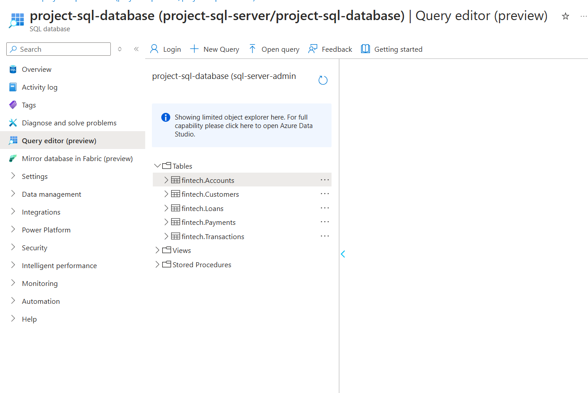
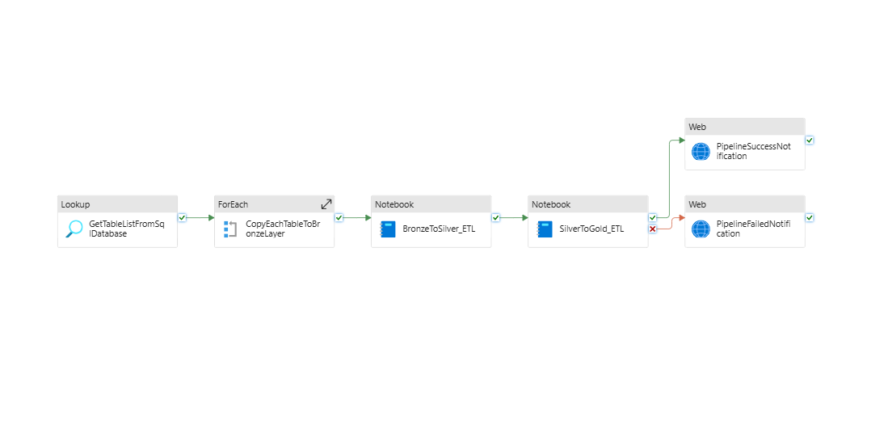
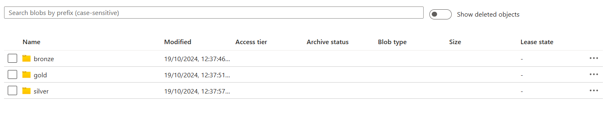
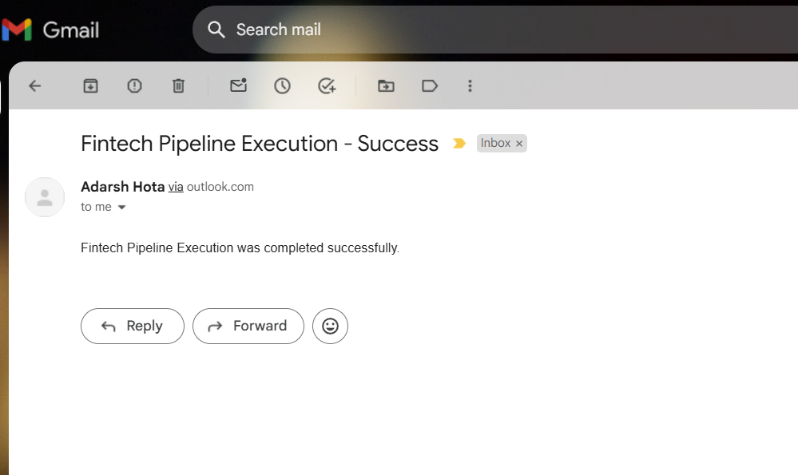

# Pipeline Steps

The following are the main steps of the pipeline:

### 1. SQL Database Preparation

Create and structure a SQL database with tables containing historical data that will serve as the source for further processing. First, a schema named **fintech** is created within the SQL database, which includes the following tables:

- **Accounts**
- **Customers**
- **Loans**
- **Payments**
- **Transactions**



In the `sql` folder, each table has a dedicated subfolder containing the SQL files necessary for:
- Creating the table structure.
- Inserting initial records for testing and further processing.

Each subfolder includes `create_table_<table_name>.sql` and `insert_records_<table_name>.sql` files for its respective table. 

   - [View SQL Folder](../sql/)

### 2. Data Pipeline Setup in Azure Synapse



Set up a dynamic data pipeline in Azure Synapse to move data from the SQL Database to the **Bronze Layer** in Azure Data Lake Storage (ADLS). Refer to the [Pipeline Activities](Pipeline_Activities.md) and [Parameters](Parameters.md) documents for for more information on each pipeline activity and parameter details.




This Bronze Layer handles raw data storage for further transformations. In it, each table from the SQL database is stored in Parquet format under the following structure:
```
bronze/
└── fintech/
    └── <table_name>/
        └── parquet files
```

### 3. Bronze to Silver Transformation (PySpark)

Create and configure a PySpark notebook to read the raw data from the Bronze Layer and transform it into a more refined format, which is then written into the **Silver Layer** as Delta Tables.
   - [View BronzeToSilver Notebook](../notebooks/BronzeToSilver_ETL.ipynb)

```
silver/
└── fintech/
    └── <table_name>/
        └── delta files
```

### 4. Silver to Gold Transformation (PySpark)

Develop and configure another PySpark notebook to read the transformed data from the Silver Layer, apply further processing, and write the final, optimized dataset into the **Gold Layer** as Delta Tables for high-quality data.
   - [View SilverToGold Notebook](../notebooks/SilverToGold_ETL.ipynb)

```
gold/
└── fintech/
    └── <table_name>/
        └── delta files
```

### 5. Notification Configuration

Add **WebActivity** steps in the pipeline to send email notifications via Logic Apps to monitor pipeline success and failure:



- **PipelineSuccessNotification**: Set up a **WebActivity** to trigger a Logic App that sends an email notification upon successful pipeline completion.
  
- **PipelineFailedNotification**: Set up another **WebActivity** to trigger a Logic App that sends an email notification if the pipeline fails.

### 6. Automated Pipeline Execution

Enable an automation setup within Azure Synapse Analytics to schedule the existing pipeline. This configuration allows all pipeline activities—from data extraction and transformation to notifications—to run automatically and sequentially, ensuring smooth end-to-end data processing.

---

For a comprehensive breakdown of each activity and configuration, refer to the [Pipeline Activities](Pipeline_Activities.md) document.
